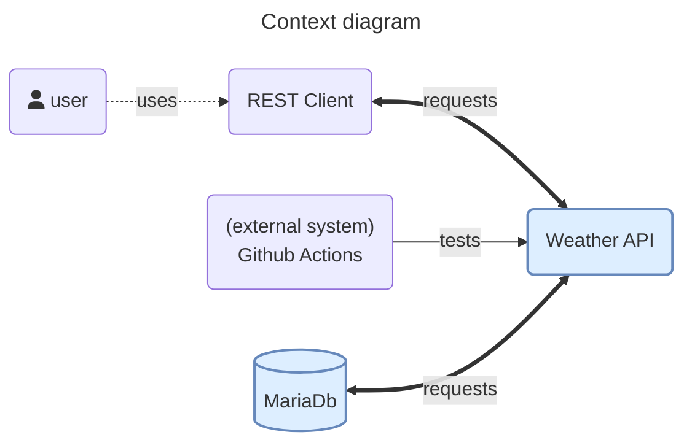
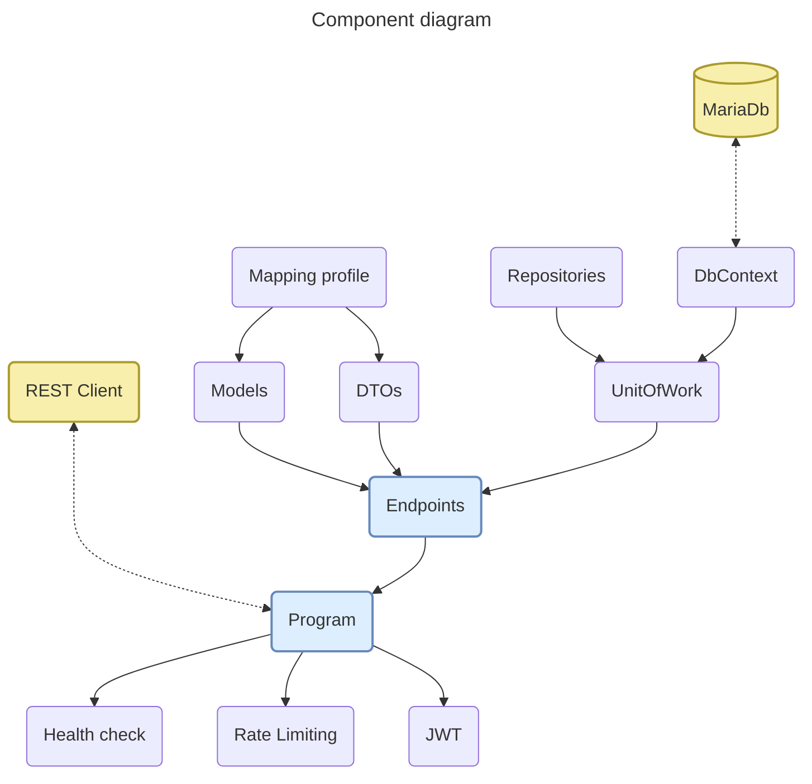
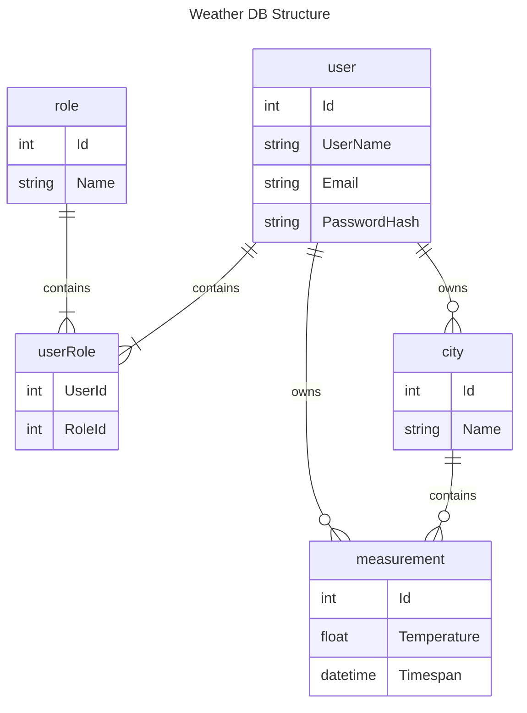

# Weather

This projects tackles the idea of integration tests.  
Most integration test tutorials handle either very simple APIs with just one set of endpoint, or don't handle important aspects like:

- setting & disposing up an in-memory database
- handling JWT authentication with roles

Before getting into the integration tests, let's get to know the system better.

## Contents

1. [Business case](#business-case)
1. [Context model](#context-model)
1. [Component model](#component-model)
1. [Models](#models)
1. [Integration tests](#integration-tests)
1. [Getting started](#getting-started)

## Business case

The purpose of the API is to create weather measurements for various cities. A user should be able to add, edit or remove his own measurements.  
An administrator should be able to add, edit or remove any measurement and be able to add, edit or remove any city.  
A city cannot be removed if it has measurements.

There should be an endpoint to see if the app is healthy.

The login should be rate limited to 10 requests per minute.

## Context model



The API works tightly with the DB. For the API, the DB is the source of truth.

The point of the integration testing is:
 - to ensure that 2 systems (in this case API & DB) work well together.
 - that the business rules (rate limiting, health check) are followed.
 - cover cases which a unit test might not cover (how many requests are sent until an error is triggered).

The Rest client is used to trigger the various endpoints of the API.

For each push / Pull Request, the Github actions will test the solution against unit & integration tests.

## Component model



The API entrypoint contains the wiring for the middlewares, services, controllers, DB, authentication, logging and mapper.

The API is configured with just 2 roles:

- users &ndash; can add, edit, remove measurements
- admins &ndash; can add, edit, remove cities & measurements

The endpoints handle all CRUD operations for all entities. Operations belonging to the same category (aka measurements), were grouped together.  
Depending on the endpoint, some operations are limited to specific roles.

In case of errors, the controllers respond with a [`Problem`](https://learn.microsoft.com/en-us/aspnet/core/fundamentals/error-handling?view=aspnetcore-7.0#problem-details) response. The `traceId` from the ProblemDetails is only displayed for InternalServerErrors and not for BadRequests or NotFound. A controller should only respond with an OkObjectResult or a Problem-ObjectResult.

`UnitOfWork` handles the transactions of the repositories registered in it. It maintains a list of objects affected by a transaction and coordinates the writing out of changes. The `Commit` method doesn't return anything since there's no use case for the return value. However, it assigns a ID number to new entities. This a behavior we want to test integration testing against!

The DB was designed with a code-first approach. Some rules were defined using fluent-API in the the DBContext. The `roles` and `users` were also modeled code-first to facilitate the integration testing. For the DB connection a project secret was used, so that it's not committed to this Git repository. To run the project locally, see [getting started](#getting-started).

The mapping profile associates the internal models with DTOs used in the frontend communication. Not all properties of the `Model` will be mapped to the `DTO`. Furthermore, some models might be mapped to more DTOs depending on the DTO's purpose. This is helpful for handling validations, controlling how much data is sent and what this data contains.

The `HealthCheck` ensures that all running processes required for the API to function are working properly. In our case, it checks that the DB is accessible, but in more complex scenarios it could ping other APIs, check file system permissions etc.  
Since the check is not something which runs in isolation, it's a very good candidate for integration tests.

The Api uses [RateLimiting](https://learn.microsoft.com/en-us/aspnet/core/performance/rate-limit) mainly to limit the number of requests on the login endpoint.  
But since it's a good practice to have a fair usage for all users, there's also a global rate limiter and a limit for authenticated users. If it blows up, it can be changed from appsettings or even disabled, so don't worry and be happy.

The `JWT` encodes the roles, if any, the audience, username and email. By having fixed roles, we are forced to tackle this in the integration tests.

## Models

These are the models to achieve the _Weahter_ project. Explanations follow the model.



> For brevity, the diagram doesn't contain all Foreign-Keys.

The user contains only the necessary properties for login, aka `UserName`, `PasswordHash` and a reference to the `roleUser` table.  
The password hash is computed using the [`IPasswordHasher<TUser>` implementation](https://learn.microsoft.com/en-us/dotnet/api/microsoft.aspnetcore.identity.ipasswordhasher-1?view=aspnetcore-7.0).

A user can, based on his role, create only measurements or both measurements & cities.

## Integration tests

The pipeline in the integration tests is quite interesting as it overwrites the default database & JWT options. Each Test Unit then initializes the in-memory database with only the data it needs for the test and then makes sure it's disposed at the end.

The tests use only the API methods, thus making sure that if the internals of the API change, as long as the call stays the same, the test won't have to change.

Reiterating what was said at the beginning, the integration tests ensure:
 - that 2 systems (in this case API & DB) work well together.
 - that the business rules (rate limiting, health check) are followed.
 - cover cases which a unit test might not cover (how many requests are sent until an error is triggered).

Why not just set up Docker and use a real database and then dispose it?
 - having an in-memory DB ensures, that your system has one dependency less.
 - it simplifies the testing pipeline, as no Docker is required.
 - saves some money for starting-up docker instances.

For basic stuff, like how to create such a project, and what are the available methods of the `WebApplicationFactory`, please see [this MS article](https://learn.microsoft.com/en-us/aspnet/core/test/integration-tests?view=aspnetcore-8.0).

### Database set-up

In the article above, the DB is registered as a simple connection. In real-world APIs this is hardly the case, as there'll be more users, so it's a good idea to use [DbContextPooling](https://learn.microsoft.com/en-us/ef/core/performance/advanced-performance-topics?tabs=with-di%2Cexpression-api-with-constant#dbcontext-pooling).  
When a DbContextPool is created, it uses a different ServiceDescriptor than a simple DbContext. So, how to deal with it?

The first thing to do, is remove the configuration options for the existing pool. This is done in the `RemoveRealServices` method

```c#
private static void RemoveRealServices(IServiceCollection services)
   {
      var dbContextDescriptor = services.SingleOrDefault(d => d.ServiceType == typeof(DbContextOptions<WeatherDbContext>));
      if (dbContextDescriptor != default)
      {
         services.Remove(dbContextDescriptor);
      }
   }
```

Next, to have a functioning DB, a new DbContextPool is created with the in-memory DB.

> Removing the connection options, won't remove all DB traces. So, we have to create the same type of DBContext like it was created in the pipeline.

```C#
private static void ConfigureIntegrationDatabase(IServiceCollection services)
{
   services.AddSingleton<DbConnection>(_ =>
   {
      var connection = new SqliteConnection("DataSource=:memory:");
      connection.Open();

      return connection;
   });

   services.AddDbContextPool<WeatherDbContext>((container, options) =>
   {
      var connection = container.GetRequiredService<DbConnection>();
      options.UseSqlite(connection);
   });
}
```

Because we're using SQLite and the connection is registered as a singleton, the connection has to be manually disposed when the factory is disposed! This step is often missed in other tutorials!

```C#
public override async ValueTask DisposeAsync()
{
   var scope = this.Services.CreateAsyncScope();
   var dbContext = scope.ServiceProvider.GetRequiredService<WeatherDbContext>();
   var connection = scope.ServiceProvider.GetRequiredService<DbConnection>();
   await dbContext.Database.EnsureDeletedAsync();
   await connection.DisposeAsync();
   await base.DisposeAsync();
}
```

Finally, the factory has a method to seed the DB with just the required tables. Ideally, this would be solved using type injection, but I didn't manage to figure it out yet 😅.

## Getting started

1. If you don't have a Maria DB Server installed, head over to [MariaDB](https://mariadb.org/download/) and install the latest version.
2. Install [.Net 8 SDK](https://dotnet.microsoft.com/en-us/download/dotnet/8.0)
3. Go to `%AppData%\Roaming\Microsoft\UserSecrets\` and create the folder `mamaliga-project\`
4. Here, create a file `secrets.json` with similar content like below. The name of the connection string, audience and issuer should not change. Having this file will ensure that sensible data is not committed in the repository.

```json
{
  "ConnectionStrings:WeatherConnectionString": "server=localhost; port=3306; database=weather; user=some-user; password=some-complex-password",
  "JWTSettings": {
    "key": "type-your-secret-key-here",
    "Issuer": "WeatherApi",
    "Audience": "WeatherUser",
    "DurationInMinutes": 90
  }
}
```

5. Clone the repository: `git clone https://github.com/RaduTerec/Weather.git`
6. Navigate to `Weather` folder.
7. Build and restore the solution: `dotnet build`.
8. Run the unit tests: `dotnet test`.
9. Go to [Weather.Api](../Weather.Api/) and create your DB using the existing migrations: `dotnet ef database update`
10. Personally, I use the [Rester](https://github.com/frigus02/RESTer) extension to test the API, but feel free to use Postman or whatever flavour of REST client you like.
11. After you chose a REST client, import the existing requests library from [Weather-postman](./docs/Weather-postman.json)
12. Make sure you selected the _Development_ environment.
13. Start the project and run the `Health` request to ensure the website, DB and file access are all running within parameters.
14. Try some other requests or do something else. You're done here 😊