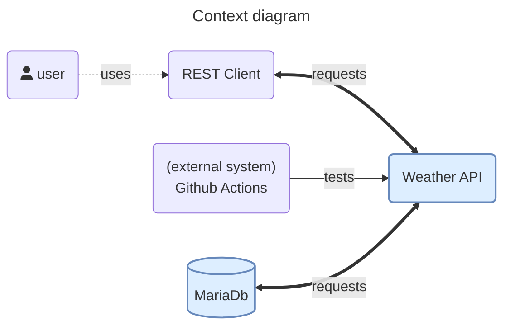
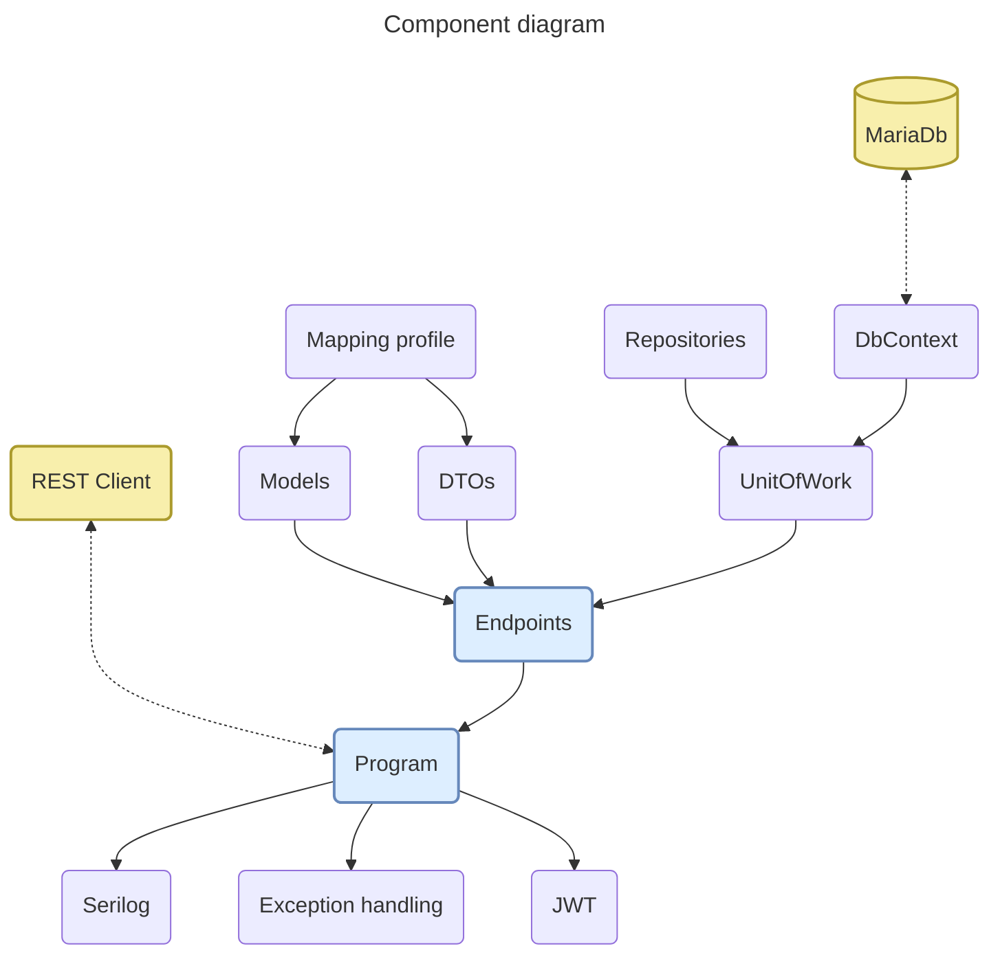
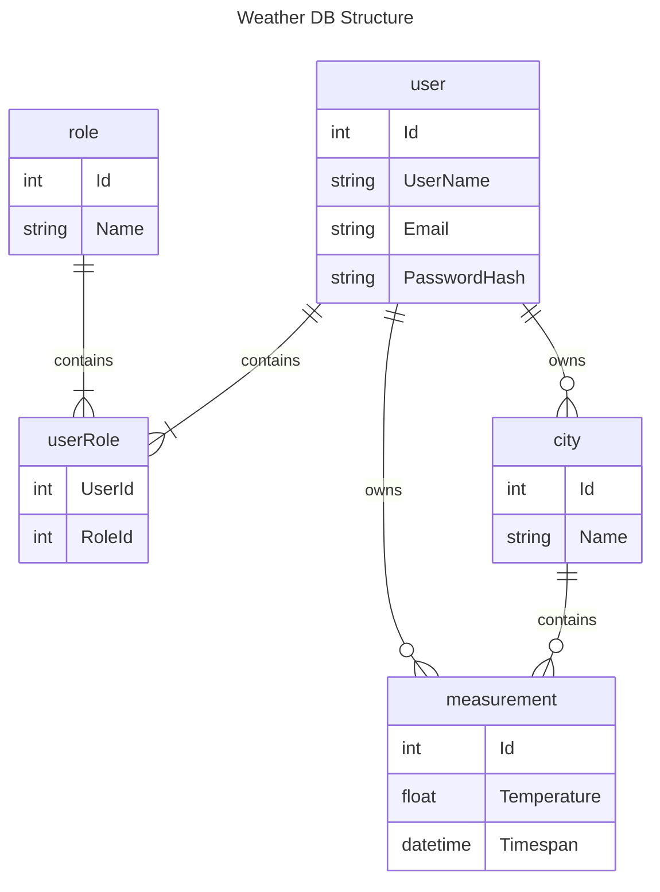

# Weather

This projects tackles the idea of integration tests.  
Most integration test tutorials handle either very simple APIs with just one set of endpoint, or don't handle important aspects like:

- setting & disposing up an in-memory database
- handling JWT authentication with roles

Before getting into the integration tests, let's get to know the system better.

## Contents

1. [Context model](#context-model)
2. [Component model](#component-model)
3. [Models](#models)
4. [Integration tests](#integration-tests)

## Context model

The purpose of the API is to create weather measurements for various cities. A user should be able to add, edit or remove his own measurements.  
An administrator should be able to add, edit or remove any measurement and be able to add, edit or remove any city.  
A city cannot be removed if it has measurements.

The API works tightly with the DB. For the API, the DB is the source of truth.

The point of the integration testing is exactly to ensure that this connection works well together. While UnitTests might cover that each individual class works well, Integration Tests ensure that 2 systems work well together.

For each push / Pull Request, the Github actions will test the solution against unit & integration tests.

## Component model

The API entrypoint contains the wiring for the middlewares, services, controllers, DB, authentication, logging and mapper.

The API is configured with just 2 roles:

- users &ndash; can add, edit, remove measurements
- admins &ndash; can add, edit, remove cities & measurements

The endpoints handle all CRUD operations for all entities. Operations belonging to the same category (aka measurements), were grouped together.  
Depending on the endpoint, some operations are limited to specific roles.

In case of errors, the controllers respond with a [`Problem`](https://learn.microsoft.com/en-us/aspnet/core/fundamentals/error-handling?view=aspnetcore-7.0#problem-details) response. The `traceId` from the ProblemDetails is only displayed for InternalServerErrors and not for BadRequests or NotFound. A controller should only respond with an OkObjectResult or a Problem-ObjectResult.

The DB was designed with a code-first approach. Some rules were defined using fluent-API in the the DBContext. The `roles` and `users` were also modeled code-first to facilitate the integration testing.

The `exception middleware`, will return a `ProblemDetails` object in case of an error. In a development environment, the stacktrace will be printed as well. The ErrorController hides its endpoints, in case it is called directly and the HttpContext contains no errors.

`Serilog` logs all events above `Information` to the HDD, in a rolling log. All errors are written in a permanent log. Currently, there is no external logging provider involved, like Seq.  
Different logging settings are enabled for production vs development environments.

The mapping profile associates the internal models with DTOs used in the frontend communication. Not all properties of the `Model` will be mapped to the `DTO`. Furthermore, some models might be mapped to more DTOs depending on the DTO's purpose. This is helpful for handling validations, controlling how much data is sent and what this data contains.

The `JWT` encodes the roles, if any, the audience, username and email. By having fixed roles, we are forced to tackle this in the integration tests.

`UnitOfWork` handles the transactions of the repositories registered in it. It maintains a list of objects affected by a transaction and coordinates the writing out of changes. The `Commit` method doesn't return anything since there's no use case for the return value. However, it assigns a ID number to new entities. This a behavior we want to test integration testing against!

## Models

These are the models to achieve the _Weahter_ project. Explanations follow the model.

> For brevity, the diagram doesn't contain all Foreign-Keys.

The user contains only the necessary properties for login, aka `UserName`, `PasswordHash` and a reference to the `roleUser` table.  
The password hash is computed using the [`IPasswordHasher<TUser>` implementation](https://learn.microsoft.com/en-us/dotnet/api/microsoft.aspnetcore.identity.ipasswordhasher-1?view=aspnetcore-7.0).

A user can, based on his role, create only measurements or both measurements & cities.

## Integration tests

The pipeline in the integration tests is quite interesting as it overwrites the default database & JWT options. Each Test Unit then initializes the in-memory database with only the data it needs for the test and then makes sure it's disposed at the end.  

The tests use only the API methods, thus making sure that if the internals of the API change, as long as the call stays the same, the test won't have to change.

The integration tests cover only the happy path of the API, because this is the most likely behavior. For all other edge cases, unit tests are used.